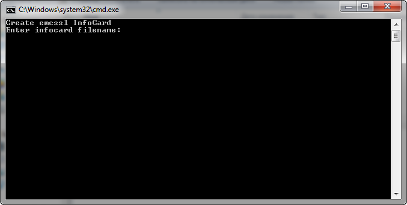

# Infocard

EmcSSL InfoCard is a decentralized distributed "business card" system on
the Emercoin blockchain that complements
[EmcSSL](EmcSSL_Introduction)'s passwordless logins, allowing website
profiles to be automatically populated. InfoCard has the ability to
organize information in a hierarchical structure, which can be useful
for quick content updates to all cards within companies or other
organizations.

InfoCard is a kind of *"business card system on the blockchain"* that
contains information about its owner, such as email address, phone
number, date of birth and so on. InfoCard can be used on sites with
[EmcSSL](EmcSSL_Introduction) authorization to automatically populate
account details, This means that rather than entering personal details
every time you create a new online account, you can provide your
InfoCard virtual business card to fill in the data.

Creating an InfoCard
--------------------

1. [Download](https://pool.emercoin.com/emcssl) the necessary scripts (or
see <https://github.com/emercoin/emcssl> for the latest development
release).

2. Next, rename the file in infocard\_example.info to
`infocard_<your_login_name>.info` and change the data to your
own. If you prefer not to provide data for some things, just remove the
line. Sample data:

```text
Alias superabdul # Short name (username, login) 
FirstName Abdul # First (short) name 
LastName Kurbashi Bey # Remain part of full name 
HomeAddress 
Sinan Pasa Mah. Hayrettin Iskelesi # Free form address 
Sok. No \#1 # Free form address 
Besiktas, Besiktas # Free form address 
Istanbul # City
34353 # ZIP code 
Turkey # Country 
HomePhone +90-555-123-4567 
WorkPhone +90-555-123-4568 
CellPhone +90-555-123-4569 
Gender M
Birthdate 1991-05-27 # May, 27, 1991 
Email abdul@bubbleinflators.com 
WEB http://www.bubbleinflators.com/superabdul 
Facebook Abdul.KurbashiBey
Twitter AbdulKurbashiBey 
EMC EdvJ7b7zPL6gj5f8VNfX6zmVcftb35sKX2 # Emercoin payment address 
BTC 1MkKuU78bikC2ACLspofQZnNb6Vz9AP1Np # BitCoin payment address 
```

3. Go to the X509 folder and run `info_crypt.sh`:

```
$ cd downloads/X509
$ ./info_crypt.sh infocard_<your_login_name>.info
```

In Windows, run by double-clicking the file `info_crypt.bat` and enter the InfoCard name:



If all goes well, the output will contain a message like this:
```text
Please, deposit into Emercoin NVS pair:
Key: info:e120319a479f4ac4
Value: body of the file: infocard_<your_login_name>.info.ze

To link your EMCSSL certificate to this info file, run ./gen_tpl.sh and use value for UID: info: e120319a479f4ac4: ac7c3821f171b6a8bd8cd33d829f5b
```

*Please note that this information is not stored anywhere, so it is
advisable to keep a record in a text document.*

4. The next step is to import the business card to the network. To do this,
open your wallet and go to the tab Manage Names. In the **Name** box,
copy our Key, `info:e120319a479f4ac4`. In the **Value** field, paste the
contents of the file *.ze, which should be in the scripts folder. The
contents of the file will look like gibberish - and should, this is
normal. The **New address** field should be left blank.


Click **submit** and you're done!

5. Now, return to the [EmcSSL Guide](EmcSSL_Guide).
